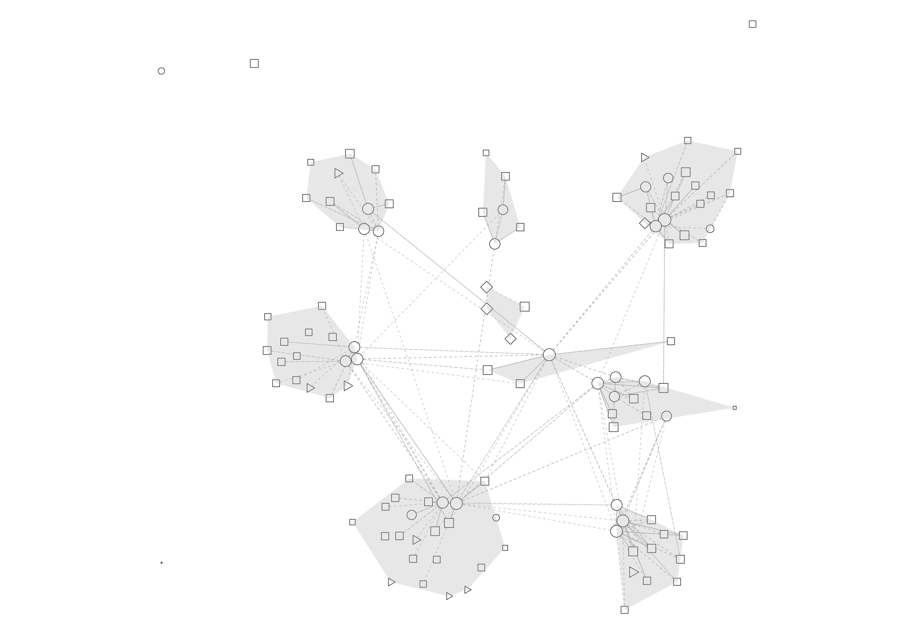
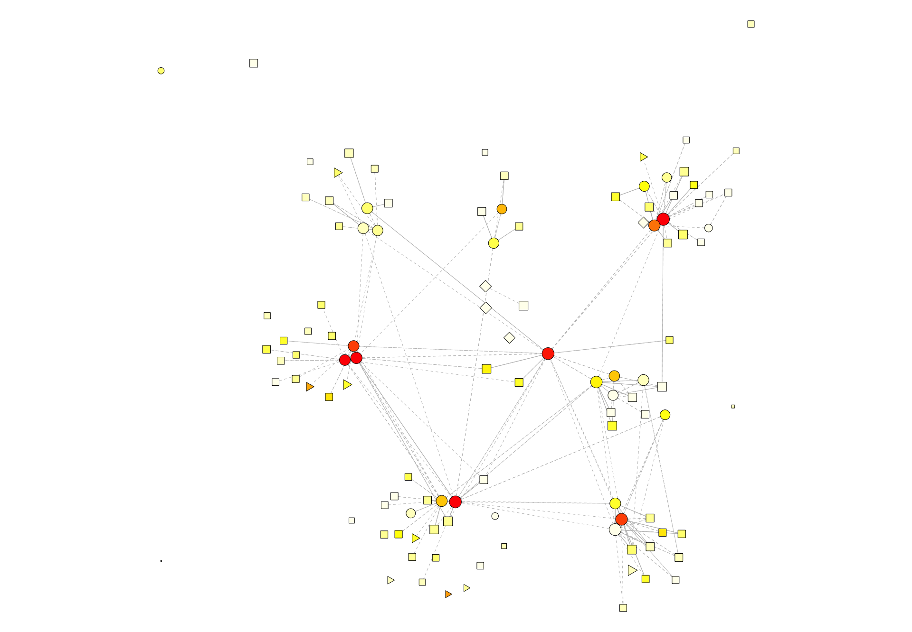
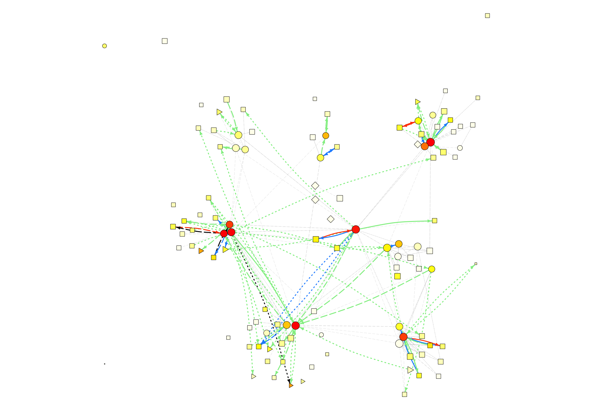

# HD3 Transfers

## Analyzing Patient Movement in the Atlanta HD3 Area

### Table of Contents

- [Overview](#overview)
- [Data Merging](#data-merging)
- [Network Generation](#network-generation)
- [Clustering and Layout](#clustering-and-layout)<sup id=clustering-and-layout-toc>[1](#footnote-1)</sup>
- [Output](#output)
- [Results](#results)

### Overview

In my work as a data analyst with a government agency, I was given a dataset of digitized case reports of people who came in to private practice doctors, public hospitals, and nursing facilities (both long-term care and long-term acute care) and tested positive for a certain antibiotic-resistant infection (ARI).

Thanks to another government entity, I also obtained a dataset of all of the patient movement in the Atlanta HD3 area within the same timeframe. I merged the datasets and mapped both the denominator data (all patient movement) and the numerator data (ARI movement) to see if the way that patients moved in the HD3 area was indicative of the way the ARI spread.

### Data Merging

[`Data Merging.R`](Data%20Merging.R)

The two datasets I got that contained patient transfer data had one common feature, which is the CCN of the facility. I obtained a Master Facility List to use for merging the datasets according to their CCNs. Once I had all the data on the facilities merged into one comprehensive list, I exported it to [`Cleaned Data/Merged Facilities.csv`](Cleaned%20Data/Merged%20Facilities.csv).

I also had to merge transfer data, which was made pretty easy with the `aggregate()` function. I created a merged facility list and then pulled out all the indirect transfers from my denominator dataset which matched facilities in my list. Then I did the same for the numerator data, and merged all my results into one dataframe, which I wrote to [`Cleaned Data/Merged Transfers.csv`](Cleaned%20Data/Merged%20Transfers.csv).

I then manually added both sheets into one Excel workbook, [\`Cleaned Data/Merged Data.xlsx](Cleaned%20Data/Merged%20Data%20(Template).xlsx)

### Network Generation

[`Graph Generation.R`](Graph%20Generation.R)

To generate the transfer network, I used the [igraph package for R](http://igraph.org/r/). I treated each facility in the merged facility list as a node, and each transfer in the merged transfers list as an edge. For visualization purposes, facilities with no "type" (e.g. the patient died, the patient was incarcerated), facilities with no connections, and loop edges are removed.

### Clustering and Layout

[`Plotting.R`](Plotting.R)

In order to generate a reasonable, intuitive layout for the graph, I clustered the graph using igraph's [`cluster_optimal()`](http://igraph.org/r/doc/cluster_optimal.html) functionality, weighted according to the denominator transfers. This means that igraph looked for clustering with the highest modularity score, where edge weights were considered to be the number of transfers between two facilities.

Once the clustering is complete, to compute a visually sensical layout, [`layout_with_fr()`](http://igraph.org/r/doc/layout_with_fr.html), which considers nodes to have an electron (repulsive) force and edges to have an elastic (attractive) force. The edges are weighted based on whether or not they cross cluster lines, so that facilities which are in the same cluster are much closer together. This makes the clusters immediately visually obvious.

### Output

[`Output.R`](Output.R)

Because all the functionality is compartmentalized into different .R files, the only one you need to mess with to get different plots is Output.R. There are a bunch of different possibilities depending on which parameters you want to visualize. These are the possibile values for parameters to pass to `plot_network()`:

- label\_clusters
  - TRUE: Put cluster labels (numbers) in the geometric mean of each cluster.
  - FALSE: Don't do that.
- polygon\_clusters
  - TRUE: Draw a polygon over each cluster to indicate where the clusters are.
  - FALSE: Don't do that.
- node\_sizes
  - "uniform": Size nodes uniformly.
  - "stays": Size nodes according to the number of stays at that facility (logarithmic scale).
- node\_colors
  - "uniform": Don't color the nodes.
  - "cluster": Each node in a cluster has the same color.
  - "cases": Color each node according to the number of cases of ARI at that facility.
  - "prevalence": Color each node according to the *rate* of ARI at that facility.
- edges\_to\_plot
  - "suppress": Don't plot edges.
  - "ari": Plot all edges with more than 35 transfers, as well as edges which contain ARI.
  - "all": Plot all edges with more than 35 transfers. I know this is misleading.
- edge\_colors
  - "suppress": Don't...color...edges? I guess.
  - "denominator": Color all the edges grey.
  - "ari": Color edges according to the number of ARI transferred along that edge
  - "percent\_ari": Color edges according to the *rate* of ARI transferred along that edge
- edge\_widths
  - "uniform": Uniform edge widths.
  - "transfers": Make edges that have more transfers thicker (log scale).
  - "ari" or "percent\_ari": Edges that contain ARI are `lwd=3`, edges without are `lwd=1`.
- highlight\_facility
  - TRUE: Requires you to pick a node which you want to be highlighted, and highlights that facility accordingly.
  - FALSE: Doesn't do that.

### Results

Demonstrating clustering, nodes sized according to stays:



``` r
plot_network(polygon_clusters = TRUE, node_sizes = 'stays', node_colors = 'uniform', edges_to_plot = 'all', edge_colors = 'denominator', edge_widths = 'uniform')
```

Coloring nodes according to ARI present at that facility:



``` r
plot_network(node_sizes = 'stays', node_colors = 'cases', edges_to_plot = 'all', edge_colors = 'denominator', edge_widths = 'uniform')
```

Coloring transfers according to ARI present along each edge:



``` r
plot_network(node_sizes = 'stays', node_colors = 'cases', edges_to_plot = 'ari', edge_colors = 'ari', edge_widths = 'ari')
```

---

#### Notes

[1](#clustering-and-layout-toc) <small id="footnote">_This step no longer works as of `igraph` update [2.1.2](https://github.com/igraph/rigraph/issues/273) due to the removal of the embedded GLPK dependency. At the time of writing, however, it worked fine._</small>